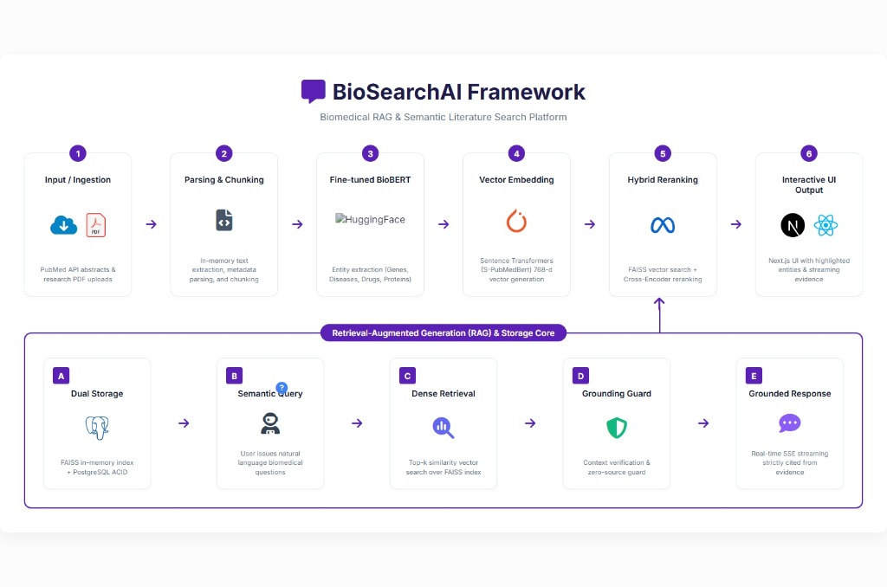

<h1 align="center">
  BioSearchAI 🧬
</h1>

<p align="center">
  <strong>An enterprise-grade, two-stage Retrieval-Augmented Generation (RAG) system tailored for biomedical research.</strong>
</p>

<p align="center">
  <a href="https://opensource.org/licenses/MIT"></a>
  <a href="https://www.python.org/downloads/release/python-3100/"></a>
  <a href="https://fastapi.tiangolo.com/"></a>
  <a href="https://nextjs.org/"></a>
  <a href="https://www.docker.com/"></a>
</p>

---

## 🎥 See it in Action

BioSearchAI streams grounded, fully-cited answers directly from PubMed abstracts and clinical PDFs.

[](https://www.youtube.com/watch?v=_AZ_LPGhzWI)

---

## ✨ Features

- **Domain-Specific NER:** Integrates a fine-tuned BioBERT model to proactively extract complex entities (Genes, Diseases, Drugs, Proteins) from source documents.
- **Hybrid Semantic Search:** Achieves maximal recall by blending Dense Vector Search (`S-PubMedBert-MS-MARCO` embeddings via FAISS) with Sparse BM25 Search (PostgreSQL GIN indexing) using Reciprocal Rank Fusion (RRF).
- **Cross-Encoder Precision:** Reranks the top candidates using a Transformer Cross-Encoder (`ms-marco-MiniLM-L-6-v2`) for pinpoint token-to-token semantic precision.
- **Asynchronous Ingestion:** Built for scale with decoupled, event-driven document ingestion using Celery and Redis to prevent LLM/embedding inference from blocking HTTP worker threads.
- **Streaming UI:** A modern Next.js frontend that streams the LLM response via Server-Sent Events (SSE), complete with citations and source grounding guards.

---

## 🏗️ Architecture

BioSearchAI moves beyond naive vector search by implementing a production-ready **Two-Stage Hybrid Retrieval Pipeline** and an **Event-Driven Ingestion Engine**.

1. **Ingestion & Parsing:** Unstructured PDFs or PubMed abstracts are ingested asynchronously, parsed, and chunked using a token-aware sliding window (450 tokens with 50-token overlap) to preserve semantic boundaries.
2. **Entity Extraction:** The text is scanned for domain-specific medical entities.
3. **Vectorization:** Sentences are converted to dense 768-d embeddings.
4. **Dual Storage:** Embeddings are written to FAISS while document text, metadata, and sparse indices live in PostgreSQL.
5. **Retrieval & Reranking:** Queries retrieve the top 25 chunks via Hybrid Search, and a Cross-Encoder narrows this to the absolute most relevant top-$K$ contexts.
6. **Grounded Response:** The LLM generates a response strictly constrained to the provided context and streams it to the client.

<br/>



---

## 📊 Performance Evaluations

BioSearchAI was tested against rigorous domain-specific biomedical test sets with the following results:

- **NER Extraction:** 0.88 F1-score for chemical and disease extraction across test sets.
- **Retrieval Accuracy:** 100% Top-1 Recall on domain-specific testing via FAISS.
- **Reranked Accuracy:** 85.71% precision via Cross-Encoder reranking (MS-MARCO).

---

## 🐳 Getting Started (Local Setup)

You can run the entire BioSearchAI stack locally with Docker Compose. This spins up the FastAPI backend, Next.js frontend, PostgreSQL database, Redis, and Celery workers.

### Prerequisites
- Docker & Docker Compose
- An OpenAI API Key

### Installation

1. **Clone the repository:**
   ```bash
   git clone https://github.com/talhasaleemm/BioSearchAI.git
   cd BioSearchAI
   ```

2. **Configure Environment Variables:**
   ```bash
   # Copy the template
   cp .env.example .secrets.env
   ```
   *Edit `.secrets.env` and insert your OpenAI API Key.*
   ```env
   DATABASE_URL=postgresql://postgres:postgres@db:5432/biosearchai
   REDIS_URL=redis://redis:6379/0
   OPENAI_API_KEY=sk-your_live_key_here
   NEXT_PUBLIC_API_URL=http://localhost:8000
   ```

3. **Launch the Stack:**
   ```bash
   docker compose up --build -d
   ```
   *The backend API will be available at `http://localhost:8000` and the Next.js frontend at `http://localhost:3000`.*

---

## 📡 API Endpoints

| Method | Endpoint               | Description                          |
|--------|------------------------|--------------------------------------|
| POST   | `/auth/register`       | Create a new user account            |
| POST   | `/auth/login`          | Obtain JWT access token              |
| POST   | `/api/v1/search`       | Hybrid dense+sparse semantic search  |
| POST   | `/api/v1/rag/generate` | Grounded answer generation           |
| POST   | `/api/v1/rag/stream`   | Server-Sent Events streaming answer  |
| POST   | `/api/v1/documents/ingest` | Async document ingestion        |
